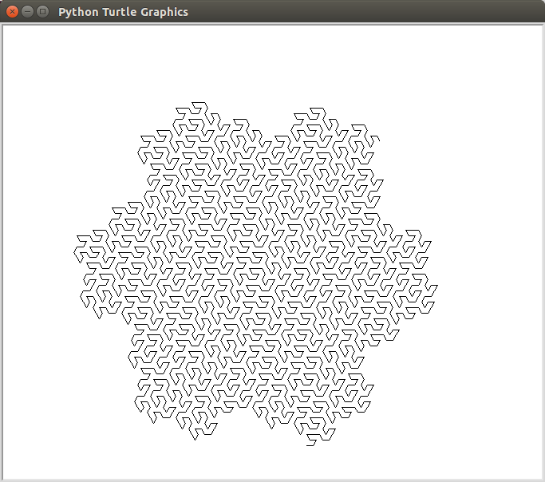

lsystem
=======

This is a Python class for generating and drawing L-system. An L-system is a
formal grammar that generates fractal curves, such as the *flowsnake* shown below.

## Requirements

This program runs in Python 3.x. It will also run in Python 2.7, if you
substitute `raw_input` for `input` in the last line. The program requires the 
`tkinter` and `turtle` packages.

## Usage

To see a demo, just type

    $ python lsystem.py

The class `Lsystem` constructs a curve from an L-system. The constructor takes
three parameters.

1. `start` is the starting string (also called the *axiom*).
2. `rules` is a dictionary that contains the rules for rewriting a string.
3. `moves` (optional) is a dictionary that converts the string into turtle commands.

The instance method `gen(n)` is a generator that yields the *n*th level of the
curve, one character at a time.

The instance method `draw` is used to draw the curve. It takes three parameters:

1.  `t` is the turtle object.
2.  `n` is the number of iterations.
3.  `step` is the step size in pixels.
4.  `moves` overrides the instance variable of the same name.

